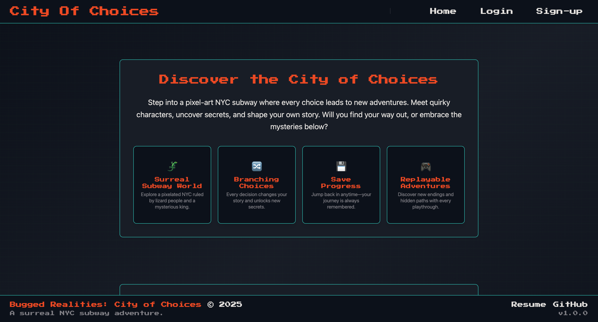
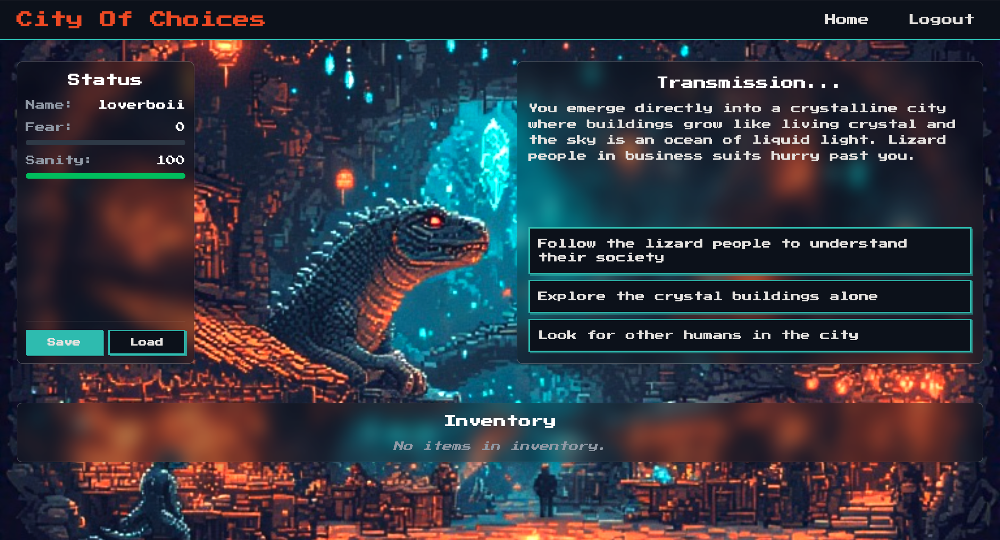
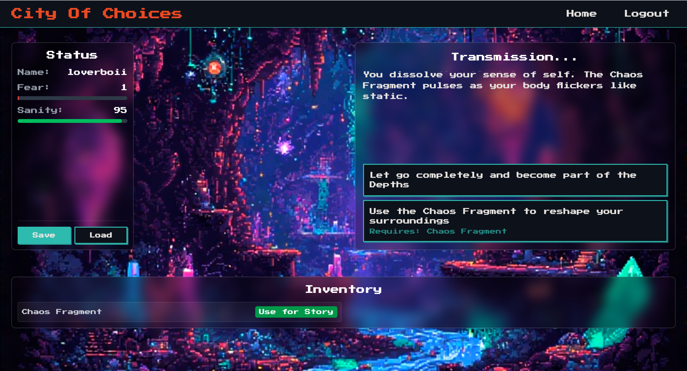
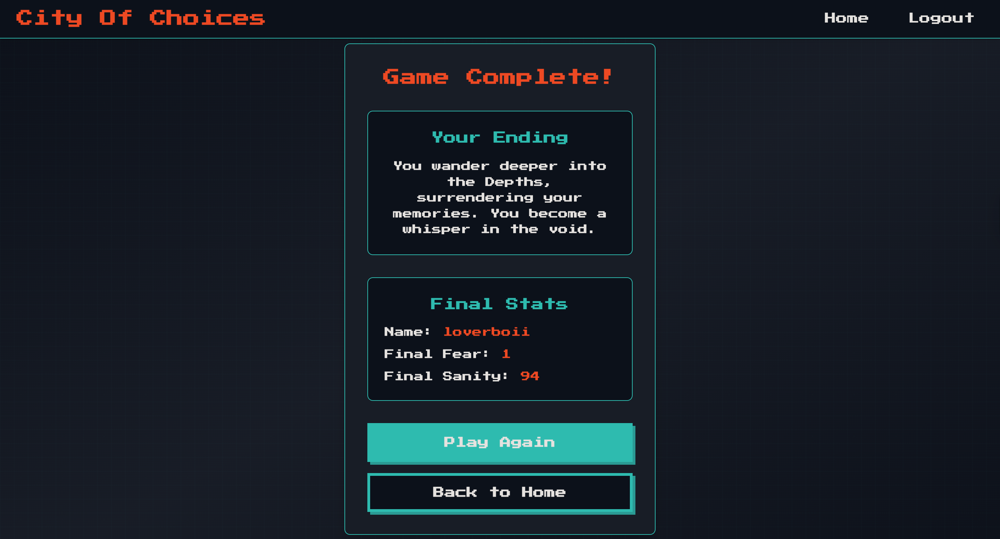

# City of Choices

A pixel-art interactive story game set in a surreal NYC subway ruled by lizard people and mysterious forces. Every choice shapes your journey through branching narratives with multiple endings.

## Game Overview

**City of Choices** is an immersive text-based adventure where you navigate through a pixelated New York City subway system. The world is ruled by lizard people and overseen by a mysterious king. Your decisions determine your fate as you explore the depths of this surreal underground world.



### Key Features

- **Branching Storylines**: Every choice leads to different outcomes and story paths
- **Dynamic Backgrounds**: Pixel-art backgrounds that change based on your location
- **Character Progression**: Manage your character's fear and sanity stats
- **Inventory System**: Collect and use items to unlock new story paths
- **Multiple Endings**: Discover different endings based on your choices
- **Save/Load System**: Continue your journey anytime with persistent progress

## 🛠️ Technology Stack

### Frontend

- **React 18** with TypeScript
- **Vite** for fast development and building
- **Tailwind CSS** for styling
- **React Router** for navigation
- **Custom Hooks** for game state management

### Backend

- **Flask** with Python
- **SQLAlchemy** for database management
- **Alembic** for database migrations
- **JWT** for authentication
- **PostgreSQL** database

## 🚀 Getting Started

### Prerequisites

- Node.js (v16 or higher)
- Python 3.8+
- PostgreSQL database

### Installation

1. **Clone the repository**

   ```bash
   git clone https://github.com/yourusername/city-of-choices.git
   cd city-of-choices
   ```

2. **Set up the backend**

   ```bash
   cd backend
   python -m venv venv
   source venv/bin/activate  # On Windows: venv\Scripts\activate
   pip install -r requirements.txt

   # Set up database
   flask db upgrade
   python run.py
   ```

3. **Set up the frontend**

   ```bash
   cd frontend
   npm install
   npm run dev
   ```

4. **Open your browser**
   Navigate to `http://localhost:5173` to start playing!

## 🎯 Game Mechanics

### Story Progression

- Make choices that affect your character's stats (fear/sanity)
- Collect items that unlock new story paths
- Navigate through different environments: subway tunnels, underground cities, and surreal depths

### Character System

- **Fear**: Increases with dangerous choices
- **Sanity**: Decreases with surreal encounters
- **Inventory**: Collect items to use in specific situations

### Environments

- **Subway Tunnels**: Mysterious and claustrophobic
- **Underground Cities**: Vibrant and populated by lizard people
- **The Depths**: Surreal and reality-warping

## 📁 Project Structure

```
CityOfChoices/
├── backend/
│   ├── app/
│   │   ├── models/          # Database models
│   │   ├── routes/          # API endpoints
│   │   └── data/           # Story data
│   ├── migrations/          # Database migrations
│   └── requirements.txt
├── frontend/
│   ├── src/
│   │   ├── components/     # React components
│   │   │   ├── game/       # Game-specific components
│   │   │   ├── ui/         # UI components
│   │   │   ├── character/  # Character system
│   │   │   └── save-load/  # Save/load functionality
│   │   ├── hooks/          # Custom React hooks
│   │   │   └── game/       # Game state management
│   │   ├── api/            # API integration
│   │   └── types/          # TypeScript types
│   └── package.json
└── README.md
```

## 🎨 Design Philosophy

### Visual Style

- **Pixel Art Aesthetic**: Retro-inspired graphics
- **Dark Atmosphere**: Mysterious and immersive
- **Dynamic Backgrounds**: Environments change with story progression

### User Experience

- **Responsive Design**: Works on desktop and mobile
- **Smooth Transitions**: Seamless background changes
- **Intuitive Interface**: Easy-to-use choice system

## 🔧 Development

### Code Organization

- **Component Separation**: Organized by functionality (game, UI, character, etc.)
- **Custom Hooks**: Separated game logic into focused hooks
- **Type Safety**: Full TypeScript implementation
- **Error Handling**: Comprehensive error management

### Key Features Implemented

- ✅ User authentication system
- ✅ Dynamic story progression
- ✅ Background system with smooth transitions
- ✅ Character stat management
- ✅ Inventory system
- ✅ Save/load functionality
- ✅ Responsive design
- ✅ Error handling and validation

## 🎮 How to Play

1. **Create an Account**: Sign up to start your journey
2. **Make Choices**: Click on story options to progress
3. **Manage Stats**: Watch your fear and sanity levels
4. **Collect Items**: Find items to unlock new paths
5. **Explore**: Discover different endings through multiple playthroughs

## Game UI/UX

- When you first create an account, you’ll enter the game world, make your first choices, and view your player stats: 


- As you acquire items, an **Inventory button appears**, allowing you to use them strategically. Certain paths in the game require specific items to progress:


- When you complete the game, an **End Screen** appears showing your final stats and a personalized ending message:


## 🤝 Contributing

1. Fork the repository
2. Create a feature branch (`git checkout -b feature/amazing-feature`)
3. Commit your changes (`git commit -m 'Add amazing feature'`)
4. Push to the branch (`git push origin feature/amazing-feature`)
5. Open a Pull Request

## 📝 License

This project is licensed under the MIT License - see the [LICENSE](LICENSE) file for details.

## 🙏 Acknowledgments

- Pixel art backgrounds created with AI assistance
- Story inspired by surreal and cyberpunk themes
- Built with modern web technologies for optimal performance

---

**Ready to explore the City of Choices?** 🚇✨
